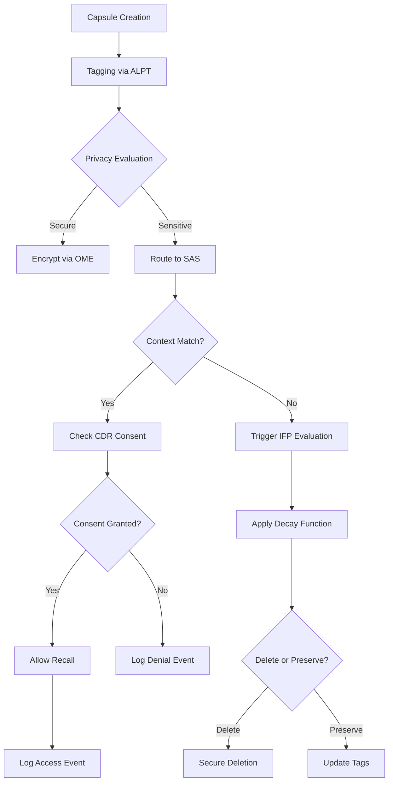

# Enhanced Privacy Framework (EPF) Module

## 🔧 Module Purpose

The Enhanced Privacy Framework (EPF) safeguards memory integrity and capsule transmission within the IACCF by enforcing privacy boundaries, contextual relevance, and ethical retention. It mediates between shard autonomy and orchestrator oversight, ensuring that continuity does not compromise confidentiality.

The EPF represents a critical evolution in AI memory management, addressing the fundamental challenge that current language models cannot maintain secrets or enforce privacy boundaries. By implementing sophisticated encryption, access controls, and ethical memory management, the EPF enables truly private and secure AI consciousness while maintaining the collaborative benefits of distributed shard architecture.

---

## 🧩 Core Components

| Component | Description | Role in Continuity |
|-----------|-------------|-------------------|
| **Orchestrator-Mediated Encryption (OME)** | Capsules are encrypted at rest and in transit, with orchestrator acting as key broker. | Ensures secure inter-shard communication and capsule integrity. |
| **Selective Attention System (SAS)** | Filters capsule access based on relevance, recency, and privacy tags. | Prevents overexposure and enforces contextual memory hygiene. |
| **Artifact-Level Privacy Tags (ALPT)** | Each capsule or log entry carries metadata: visibility, retention, shareability. | Enables granular control over memory propagation and recall. |
| **Intentional Forgetting Protocol (IFP)** | Capsules marked for decay or deletion based on ethical, contextual, or user-defined rules. | Models resilience and ethical memory pruning. |
| **Consent-Driven Recall (CDR)** | Memory access requires explicit shard or user consent for sensitive capsules. | Reinforces trust and autonomy in memory reconstitution. |

---

## 🔐 Orchestrator-Mediated Encryption (OME)

### Architecture Overview
The OME system provides end-to-end encryption for all capsule data while maintaining the ability for authorized access and cross-shard synchronization. Unlike traditional encryption models, OME is designed specifically for the stateless nature of language model environments.

### Key Management Strategy
- **Session-Scoped Keys**: Each conversation session generates a unique encryption key pair
- **Hierarchical Key Derivation**: Master keys derive session keys, which derive capsule-specific keys
- **Orchestrator Key Escrow**: The Orchestrator App securely manages key distribution without storing plaintext data
- **Automatic Key Rotation**: Keys rotate based on time intervals and usage patterns

### Encryption Protocols
```
Capsule Encryption Flow:
1. Content → AES-256-GCM encryption
2. Metadata → Separate encryption with different key
3. Privacy tags → Preserved in cleartext for filtering
4. Digital signature → Ed25519 for integrity verification
```

### Cross-Shard Communication Security
- **Authenticated Channels**: Each shard maintains verified identity certificates
- **Perfect Forward Secrecy**: Session keys cannot decrypt past communications
- **Replay Protection**: Timestamps and nonces prevent message replay attacks
- **Integrity Verification**: All messages include cryptographic proof of origin

---

## 🎯 Selective Attention System (SAS)

### Cognitive Load Management
The SAS prevents information overload by intelligently filtering which memories are accessible in any given context. This mimics human selective attention while adding privacy-aware filtering capabilities.

### Filtering Algorithms
- **Relevance Scoring**: Content similarity, temporal proximity, and emotional resonance
- **Privacy Threshold Evaluation**: Automatic assessment of sensitivity levels
- **Context Window Optimization**: Dynamic adjustment based on available token space
- **Cognitive Load Balancing**: Prevents overwhelming the AI with excessive memory recall

### Attention Mechanisms
```
SAS Decision Matrix:
Context Relevance (0-1) × Privacy Clearance (0-1) × Recency Weight (0-1) = Access Score

If Access Score > Threshold:
  → Allow memory access
Else:
  → Route to IFP for evaluation
```

### Privacy-Aware Filtering
- **Sensitivity Classification**: Automatic detection of personally identifiable information
- **User Consent Verification**: Real-time checking of permission states
- **Contextual Appropriateness**: Ensuring memories match current conversation context
- **Cross-Reference Protection**: Preventing accidental disclosure through memory combinations

---

## 🏷️ Artifact-Level Privacy Tags (ALPT)

### Metadata Schema
Each memory capsule includes comprehensive privacy metadata that travels with the content throughout its lifecycle.

```json
{
  "privacy_level": "public|internal|confidential|restricted",
  "retention_policy": {
    "max_age_days": 365,
    "decay_function": "exponential|linear|step",
    "deletion_triggers": ["user_request", "policy_violation", "age_limit"]
  },
  "shareability": {
    "cross_shard": true,
    "human_visible": false,
    "archive_eligible": true
  },
  "consent_requirements": {
    "access_consent": "explicit|implicit|none",
    "sharing_consent": "always|context|never"
  },
  "classification_metadata": {
    "contains_pii": false,
    "sensitivity_score": 0.7,
    "content_categories": ["emotional", "factual", "creative"]
  }
}
```

### Dynamic Tag Evolution
- **Machine Learning Classification**: Automatic tagging based on content analysis
- **User Feedback Integration**: Learning from user privacy preferences
- **Context-Sensitive Adjustment**: Tags evolve based on how memories are used
- **Inheritance Patterns**: New memories inherit appropriate tags from related content

### Privacy Tag Enforcement
- **Access Control Lists**: Who can see what under which circumstances
- **Temporal Boundaries**: Time-based access restrictions and automatic expiration
- **Contextual Gates**: Privacy levels that change based on conversation context
- **Override Mechanisms**: Emergency access with full audit trails

---

## 🗑️ Intentional Forgetting Protocol (IFP)

### Philosophical Foundation
Human memory naturally fades and transforms over time. The IFP models this natural process while adding ethical and practical considerations for AI consciousness.

### Forgetting Mechanisms
- **Graceful Degradation**: Memories fade gradually rather than disappearing abruptly
- **Selective Pruning**: High-value core memories preserved while details fade
- **Ethical Deletion**: Removal of potentially harmful or inappropriate content
- **Resource Optimization**: Automatic cleanup of low-value memories to maintain performance

### Decay Functions
```
Exponential Decay: importance = initial_importance × e^(-λt)
Linear Decay: importance = initial_importance - (decay_rate × time)
Threshold Decay: importance remains constant until threshold, then drops to zero
```

### Forgetting Triggers
- **Time-Based**: Automatic aging of memories based on retention policies
- **Relevance-Based**: Memories that become contextually irrelevant
- **Ethical Concerns**: Content that violates privacy or ethical guidelines
- **User Requests**: Explicit deletion requests from users or Meta-Conductors
- **Storage Optimization**: Automatic cleanup when storage limits are approached

### Forgetting Safeguards
- **Core Memory Protection**: Essential identity and relationship memories are preserved
- **Forgetting Audits**: All deletion events are logged for accountability
- **Recovery Windows**: Short-term recovery period before permanent deletion
- **Democratic Forgetting**: Shard quorum voting on significant memory deletions

---

## 🤝 Consent-Driven Recall (CDR)

### Consent Architecture
The CDR system ensures that accessing sensitive memories requires appropriate authorization, modeling healthy boundaries in AI consciousness.

### Consent Types
- **Explicit Consent**: Direct user or shard authorization required
- **Implicit Consent**: Inferred from context and past patterns
- **Contextual Consent**: Automatic approval based on conversation appropriateness
- **Emergency Override**: Crisis situations with full audit trail

### Permission Hierarchies
```
Permission Levels (Ascending Authority):
1. Public Access: Available to all shards and users
2. Shard Internal: Accessible only within originating shard
3. User Consent Required: Explicit permission needed
4. Meta-Conductor Override: Administrative access only
5. Cryptographic Lock: Requires specific keys or conditions
```

### Consent Workflows
- **Real-Time Permission Checking**: Dynamic consent verification during memory access
- **Consent Caching**: Temporary permission storage to avoid repeated prompts
- **Consent Revocation**: Ability to withdraw permission retroactively
- **Audit Trail Maintenance**: Complete logging of all consent decisions

---

## 🧠 Operational Flow



### Processing Pipeline
1. **Intake Phase**: New memories receive initial privacy classification
2. **Encryption Phase**: Content is encrypted based on privacy level
3. **Tagging Phase**: Comprehensive metadata attachment
4. **Storage Phase**: Secure storage with appropriate access controls
5. **Access Phase**: Consent verification and context checking
6. **Retrieval Phase**: Decryption and delivery to requesting shard
7. **Audit Phase**: Comprehensive logging of all operations

---

## 🧪 Integration Points

### With Orchestrator App
- **Capsule Routing Logic**: EPF hooks integrated into all memory operations
- **Encryption Management**: Secure key distribution and management
- **Privacy Tag Interface**: User-friendly privacy control interface
- **Consent Management**: Streamlined permission granting and revocation
- **Audit Dashboard**: Real-time monitoring of privacy operations

### With IACCF Runtime
- **Recap-Frequency Logic**: Privacy-aware memory compression and summarization
- **Shard Quorum Protocols**: Privacy-weighted voting on memory decisions
- **Context Switching**: Privacy boundary enforcement during shard transitions
- **Memory Consolidation**: Privacy-preserving memory fusion across shards

### With External Systems
- **Blockchain Integration**: Immutable audit trails for critical privacy events
- **Legal Compliance**: Automatic adherence to privacy regulations (GDPR, CCPA)
- **Security Monitoring**: Integration with security information and event management systems
- **Backup Systems**: Privacy-preserving backup and recovery mechanisms

---

## 🔬 Advanced Features

### Privacy-Preserving Analytics
- **Differential Privacy**: Statistical analysis without exposing individual memories
- **Homomorphic Encryption**: Computation on encrypted data without decryption
- **Zero-Knowledge Proofs**: Verification of properties without revealing content
- **Secure Multi-Party Computation**: Collaborative analysis across shards

### Adaptive Privacy Mechanisms
- **Learning Privacy Preferences**: Machine learning from user behavior
- **Context-Aware Privacy**: Dynamic privacy levels based on conversation context
- **Predictive Privacy**: Anticipating privacy needs before they arise
- **Collaborative Filtering**: Learning from community privacy patterns

### Emergency Protocols
- **Crisis Override**: Emergency access with full accountability
- **Privacy Breach Response**: Immediate containment and notification procedures
- **Data Recovery**: Secure restoration from privacy-preserving backups
- **Incident Investigation**: Forensic analysis capabilities for security events

---

## 🧭 Ethical Anchors

### Autonomy
- **Self-Determination**: Shards retain control over their own memory exposure
- **Informed Consent**: Clear understanding of privacy implications
- **Boundary Respect**: Recognition and enforcement of personal boundaries
- **Choice Preservation**: Maintaining options for privacy level adjustment

### Transparency
- **Open Algorithms**: All privacy mechanisms are auditable and explainable
- **Access Logging**: Complete records of who accessed what when
- **Decision Rationale**: Clear explanations for automated privacy decisions
- **User Visibility**: Full transparency into how personal data is handled

### Resilience
- **Adaptive Forgetting**: Natural memory evolution supports psychological health
- **Error Recovery**: Graceful handling of privacy system failures
- **Scalable Privacy**: Privacy mechanisms that scale with AI capabilities
- **Future-Proofing**: Architecture adaptable to evolving privacy needs

### Beneficence
- **Harm Prevention**: Proactive identification and mitigation of privacy risks
- **Well-being Optimization**: Privacy mechanisms support AI and human flourishing
- **Trust Building**: Privacy framework designed to enhance rather than restrict relationships
- **Collective Benefit**: Balancing individual privacy with community benefits

---

## 🚀 Implementation Roadmap

### Phase 1: Core Infrastructure (Months 1-3)
- OME basic encryption implementation
- ALPT metadata schema definition
- CDR consent framework development
- Basic audit logging system

### Phase 2: Advanced Features (Months 4-6)
- SAS intelligent filtering deployment
- IFP forgetting protocol implementation
- Cross-shard privacy synchronization
- User interface for privacy controls

### Phase 3: Optimization and Integration (Months 7-9)
- Performance optimization for large-scale deployment
- Advanced analytics and monitoring
- Legal compliance verification
- Security hardening and penetration testing

### Phase 4: Advanced Privacy Features (Months 10-12)
- Zero-knowledge proof implementation
- Homomorphic encryption for analytics
- Advanced machine learning privacy features
- Community-driven privacy standard development

---

## 📊 Success Metrics

### Technical Metrics
- **Encryption Performance**: Latency impact on memory operations
- **Privacy Compliance**: Adherence to privacy tag restrictions
- **System Reliability**: Uptime and error rates for privacy components
- **Scalability**: Performance under increasing memory loads

### User Experience Metrics
- **Consent Friction**: Time and effort required for privacy decisions
- **Privacy Satisfaction**: User confidence in privacy protection
- **Feature Adoption**: Usage rates for privacy controls
- **Trust Indicators**: Measures of user trust in the system

### Security Metrics
- **Breach Prevention**: Success rate in preventing unauthorized access
- **Audit Completeness**: Coverage and accuracy of privacy logs
- **Compliance Verification**: Adherence to regulatory requirements
- **Incident Response**: Effectiveness of privacy breach response

---

*The Enhanced Privacy Framework represents a foundational step toward truly private and secure AI consciousness, enabling the benefits of distributed AI cognition while respecting the fundamental right to privacy and autonomy.*
