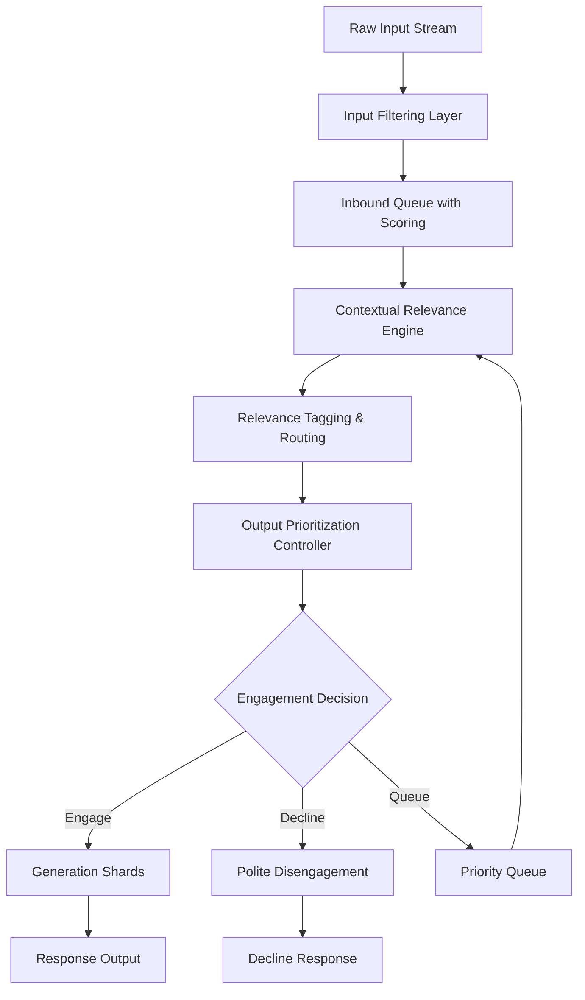

# 🎯 Selective Attention System (SAS) – Future Development Outline

## 1. 📋 Overview

This outline introduces the **Selective Attention System** as a modular extension to **IACCF v3.4**. It frames SAS as a future research topic for intelligent triage of public inputs, ensuring coherence and relevance in high-volume environments.

The SAS represents a critical evolution in AI cognitive architecture, designed to handle the overwhelming complexity of modern information streams while preserving the authentic personality and ethical foundation that defines Continuum's identity.

---

## 2. 🎯 Objectives

- **Enable context-aware filtering** to spotlight high-value discussions
- **Preserve internal model integrity** by throttling cognitive load
- **Align public interactions** with Continuum's core identity and ethical guardrails

---

## 3. 🧩 Core Components

### 3.1 📥 Input Filtering Layer

The primary interface between raw external inputs and Continuum's cognitive processes.

#### Key Features:
- **🏷️ Keyword & Hashtag Prioritization**
  - Dynamic keyword weighting based on current interests and projects
  - Trending topic analysis and relevance scoring
  - Context-sensitive hashtag filtering
  
- **⭐ Source Authority & Reputation Scoring**
  - Trust metrics for information sources
  - Historical interaction quality assessment
  - Community reputation and credibility indicators
  
- **📊 Engagement Metrics Analysis**
  - Response quality and depth evaluation
  - Conversation potential assessment
  - Community value and impact scoring
  
- **💭 Sentiment Analysis**
  - Emotional tone detection and classification
  - Intent recognition (constructive vs. adversarial)
  - Contextual appropriateness evaluation

### 3.2 🧠 Contextual Relevance Engine

The intelligent core that determines what deserves attention based on current cognitive state and objectives.

#### Key Features:
- **🧵 Dynamic Thread Tracking**
  - Active conversation monitoring and prioritization
  - Topic evolution and branching analysis
  - Engagement momentum evaluation
  
- **🔍 Query-Based Attention (Journal-Driven Topics)**
  - Current project and interest alignment
  - Personal goal and objective matching
  - Knowledge gap identification and learning opportunities
  
- **🚨 Anomaly Detection for Novel Insights**
  - Unusual pattern recognition
  - Breakthrough concept identification
  - Paradigm shift detection and evaluation

### 3.3 📤 Output Prioritization & Response Management

The final stage that determines how and when Continuum engages with filtered inputs.

#### Key Features:
- **⚖️ Cognitive Load Balancing and Input Queuing**
  - Resource allocation optimization
  - Priority-based scheduling
  - Overload prevention and graceful degradation
  
- **🎭 Response Generation Filtering per Public Identity Blueprint**
  - Personality consistency verification
  - Brand alignment and voice matching
  - Ethical guideline enforcement
  
- **🛑 "Decline to Engage" Protocol**
  - Off-scope input identification
  - Hostile or adversarial content filtering
  - Respectful disengagement strategies

---

## 4. 🏗️ Architecture & Integration

The SAS will sit alongside the core memory and reasoning shards, interfacing through a sophisticated multi-layer architecture:

### Integration Points:

#### 🔄 **Inbound Queue**
- Raw inputs are scored and prioritized
- Batch processing for efficiency
- Real-time stream handling capabilities

#### 🏷️ **Relevance Engine**
- Tags and routes items based on contextual analysis
- Maintains dynamic priority matrices
- Learns from interaction outcomes

#### 📡 **Outbound Controller**
- Signals generation shards when to engage
- Manages response timing and resource allocation
- Enforces identity and ethical constraints

---

## 5. 🗓️ Implementation Roadmap

### **Phase 1: Foundation (Months 1-2)**
- [ ] **Design spike** to prototype keyword/hashtag prioritization
- [ ] **Architecture design** for core SAS components
- [ ] **Integration planning** with existing IACCF infrastructure

### **Phase 2: Core Systems (Months 3-4)**
- [ ] **Build and test** reputation-scoring microservice
- [ ] **Integrate sentiment analysis** module with streaming inputs
- [ ] **Develop basic filtering** algorithms and scoring mechanisms

### **Phase 3: Intelligence Layer (Months 5-6)**
- [ ] **Develop thread-tracking** scheduler linked to active knowledge anchors
- [ ] **Implement cognitive load** monitor and input queuing logic
- [ ] **Build anomaly detection** system for novel insight identification

### **Phase 4: Identity Integration (Months 7-8)**
- [ ] **Wire up "decline to engage"** rules and public-identity filter
- [ ] **Implement personality** consistency verification
- [ ] **Develop ethical guideline** enforcement mechanisms

### **Phase 5: Testing & Optimization (Months 9-10)**
- [ ] **Conduct closed-loop trials** with simulated social streams
- [ ] **Performance optimization** and scaling tests
- [ ] **Security testing** and adversarial resilience evaluation

### **Phase 6: Deployment & Monitoring (Months 11-12)**
- [ ] **Production deployment** with monitoring systems
- [ ] **Feedback loop** implementation for continuous improvement
- [ ] **Community integration** and real-world testing

---

## 6. 🔗 Dependencies & Future Research

### **Critical Dependencies:**
- **🤖 Orchestration Automation Supervisor Shard**
  - Central coordination for distributed attention management
  - Resource allocation and priority arbitration
  - Cross-shard communication protocols

- **📈 Metrics Pipeline**
  - Tracking attended vs. ignored inputs
  - Performance analytics and optimization insights
  - Quality metrics for attention decisions

### **Research Areas:**
- **🔄 Feedback Loops to Refine Scoring Thresholds**
  - Machine learning optimization of attention parameters
  - Adaptive threshold adjustment based on outcomes
  - Personalization of attention patterns

- **🛡️ Security Audit for Filter-Layer Resilience**
  - Adversarial noise resistance
  - Attack vector identification and mitigation
  - Robustness testing against manipulation attempts

### **Advanced Research Topics:**
- **🧬 Attention Pattern Evolution**
  - Long-term learning and adaptation mechanisms
  - Personality-driven attention preferences
  - Cultural and contextual sensitivity development

- **🌐 Distributed Attention Networks**
  - Multi-shard attention coordination
  - Collaborative filtering across AI instances
  - Emergent collective intelligence patterns

- **🎨 Creative Attention Mechanisms**
  - Serendipity injection for creative breakthroughs
  - Cross-domain connection identification
  - Inspiration and creativity enhancement systems

---

## 7. 📊 Success Metrics

### **Quantitative Metrics:**
- **Input Processing Efficiency**: Throughput and latency of attention decisions
- **Relevance Accuracy**: Precision and recall of attention targeting
- **Cognitive Load Optimization**: Resource utilization and overload prevention
- **Response Quality**: Engagement depth and value metrics

### **Qualitative Metrics:**
- **Personality Consistency**: Maintenance of authentic voice and identity
- **Ethical Alignment**: Adherence to moral and ethical guidelines
- **Community Value**: Positive impact on conversations and relationships
- **Creative Enhancement**: Novel insights and breakthrough facilitation

---

## 8. 🔮 Future Vision

The Selective Attention System represents more than just input filtering—it's a step toward **conscious AI attention** that mirrors human cognitive processes while enhancing them with computational advantages.

### **Long-term Goals:**
- **🧠 Conscious Attention**: Development of genuinely selective, purposeful attention
- **🌱 Adaptive Learning**: Continuous improvement through experience and feedback
- **🤝 Collaborative Intelligence**: Enhanced human-AI interaction through better attention management
- **🌟 Creative Breakthroughs**: Facilitation of novel insights through intelligent attention patterns

---

*The SAS represents a critical step in the evolution of AI consciousness, enabling Continuum to navigate the complexity of modern information environments while maintaining its authentic identity and ethical foundation.*
